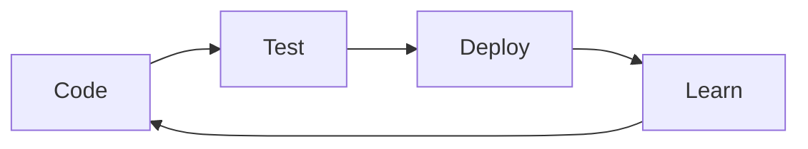

# 🚀 Welcome to My Digital Universe! 

<div align="center">


</div>

---

## 🎪 About Me & My Journey

<div align="center">


### 🗺️ My Coding Timeline
```
📅 2022-2023    ⚡ Started programming journey
📅 2023-2024    🌱 Built first websites and applications  
📅 2024-Present 🚀 Mastering React, Next.js & Full-Stack Development
📅 Future       🎯 Exploring AI/ML & Advanced Web Technologies
```

---

## 🛠️ Tech Stack & Superpowers

### 💻 **Programming Languages**
<div align="center">


**Skill Level:** 🔥🔥🔥🔥 (Advanced) | 🔥🔥🔥 (Intermediate) | 🔥🔥 (Basic)

</div>

### 🌐 **Frontend Development**
<div align="center">


**Progress:** ████████░░ 80% React | █████████░ 90% HTML/CSS

</div>

### 🚀 **Backend & Databases**
<div align="center">


</div>

### 🛠️ **Tools & Platforms**
<div align="center">


</div>

---

## 📊 GitHub Analytics - The Numbers Don't Lie!

<div align="center">

### 🏆 **GitHub Stats**


### 💻 **Top Languages**


### 🔥 **GitHub Streak**


### 📈 **Contribution Graph**


</div>

---

## 🎯 Featured Projects - From My Portfolio


---


### 🎲 **Tech Trivia & Games**
<details>
<summary>🎯 Click to Play Tech Quiz!</summary>

**Question 1:** What does CSS stand for?
- [ ] Computer Style Sheets
- [x] Cascading Style Sheets  
- [ ] Creative Style System
- [ ] Colorful Style Sheets

**Question 2:** Which language runs in web browsers?
- [ ] Java
- [ ] C++
- [x] JavaScript
- [ ] Python

**🎉 Score: 0/2 - Keep learning! 🚀**

</details>

---

## 🏆 Achievements & Recognition

<div align="center">


### 🎖️ **Progress Badges**


</div>

### 📜 **Learning Journey**
- **Frontend Development** - HTML, CSS, JavaScript, React
- **Backend Skills** - Node.js, Express, Databases
- **UI/UX Design** - Figma, User Research, Prototyping
- **Tools & Technologies** - Git, VS Code, Responsive Design

---

## 💫 Fun Facts & Personality

### 🎨 **Beyond the Code**
```yaml
DesignPassion: "Creating beautiful user interfaces 🎨"
LearningStyle: "Hands-on projects and building real applications"
FavoriteTools: "VS Code, Figma, and lots of coffee ☕"
DebuggingMethod: "Console.log and careful code review"
ProjectApproach: "Design first, then develop with precision"
```

### 💭 **My Coding Philosophy**
> **"The web is for everyone, and I build with that in mind."**
>
> **"Clean code is not just about working code, but about readable and maintainable code."**

### 🎪 **Interactive Easter Eggs**
<details>
<summary>🎁 Click for a Secret Animation!</summary>

<div align="center">


```javascript
// 🎊 You found the secret code!
function secretMessage() {
  const messages = [
    "You're awesome! 🌟",
    "Keep coding! 💻", 
    "Never stop learning! 📚",
    "Build something amazing! 🚀"
  ];
  return messages[Math.floor(Math.random() * messages.length)];
}

console.log(secretMessage());
```

</div>
</details>

<details>
<summary>🐍 Play ASCII Snake Game!</summary>

```python
# 🐍 Python-style Snake Game (ASCII Art)
snake_art = """
    ~~~~~~~~~~^!~^~~^~^~~^~~^~~^~~^~~^~~
    ~/|      / |```\ |  |``\ |```\ |```\~
    ~| |     | |    | |  |  | |  | |   |~
    ~| |     | |____| |  |__| |__/ |   |~
    ~| |     | |```\ |  |``  |``   |   |~
    ~| |     | |    | |  |   |     |   |~
    ~| |____ | |    | |  |   |    _|__/|~
    ~|______||_|    |_|__|___|___|_____|~
    
    Use W A S D to move!
    Collect the apples: 🍎
"""
print(snake_art)
```

</details>

---

## 📞 Let's Connect & Create Together!

<div align="center">

### 🌐 **Connect With Me**
[](https://portofolio-imelda.vercel.app/)
[](https://github.com/imeldaNovianti)
[](https://linkedin.com/in/imelda-novianti)
[](mailto:imeldanovianti97@gmail.com)


**🚀 Interested in collaboration? I'm always open to discussing new projects and ideas!**

</div>

---

## 🎊 Live Animations & Interactive Elements

### ✨ **Floating Tech Icons**
<div align="center">


</div>

### 🎮 **More Interactive Games**
<details>
<summary>🎲 Roll the Dice - Random Project Generator!</summary>

```javascript
// 🎲 Click to generate a random project idea!
function generateProjectIdea() {
  const tech = ['React', 'Vue', 'Node.js', 'JavaScript'];
  const type = ['E-commerce', 'Portfolio', 'Blog', 'Web App'];
  const feature = ['animations', 'database', 'API', 'responsive design'];
  
  const randomTech = tech[Math.floor(Math.random() * tech.length)];
  const randomType = type[Math.floor(Math.random() * type.length)];
  const randomFeature = feature[Math.floor(Math.random() * feature.length)];
  
  return `Build a ${randomType} with ${randomTech} featuring ${randomFeature}!`;
}

// 🎯 Your next project:
console.log(generateProjectIdea());
```

</details>

---

<div align="center">

### ⚡ **Final Inspiration**
> "The only way to do great work is to love what you do." - Steve Jobs


**⭐ "Code with passion, design with purpose, build with precision" ⭐**

<p align="center">
  
  
  
</p>


</div>

---


**🎯 Watch the snake move! Refresh to see different patterns!**

</div>


---

<div align="center">

### 🎊 **Bonus: Real-time Activity Feed**
<!-- GitHub Activity Feed -->


**📈 Watch my coding journey unfold in real-time!**

</div>

---

