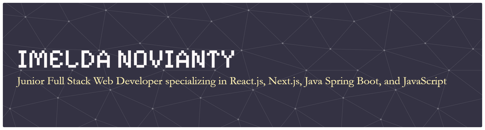

````markdown
# 🚀 Welcome to My Digital Universe! 



<div align="center">


</div>

---

## 🎪 About Me & My Journey

<div align="center">


</div>

```python
class Developer:
    def __init__(self):
        self.name = "Imelda Novianti"
        self.role = "Full-Stack Developer & UI/UX Designer"
        self.passion = "Creating digital experiences that users love"
        
    def my_philosophy(self):
        return """
        🌟 "Great design meets clean code to create exceptional experiences"
        🎯 I believe in:
        • User-centered design and development
        • Writing maintainable, scalable code
        • Continuous learning and growth
        • Collaboration and knowledge sharing
        """
    
    def current_focus(self):
        return {
            "🎨": "UI/UX Design & Frontend Development",
            "🚀": "Full-Stack Applications", 
            "📱": "Responsive Web Design",
            "💼": "Building my portfolio"
        }
````

### 🗺️ My Coding Timeline

```
📅 2022-2023    ⚡ Started programming journey
📅 2023-2024    🌱 Built first websites and applications  
📅 2024-Present 🚀 Mastering React, Next.js & Full-Stack Development
📅 Future       🎯 Exploring AI/ML & Advanced Web Technologies
```

---

## 🛠️ Tech Stack

<div align="center">


</div>

---

## 📊 GitHub Analytics

<div align="center">


</div>

---

## 🎯 Featured Projects

### 🚀 [Personal Portfolio](https://portofolio-imelda.vercel.app/)

```yaml
Tech Stack: HTML, CSS, JavaScript, Bootstrap
Features: Fully responsive, Smooth animations, Project gallery, Contact form
```


### 🎨 [UI/UX Design Projects](https://portofolio-imelda.vercel.app/#projects)

```yaml
Projects: Company Profile Websites, E-commerce Design, Mobile App UI, Brand Identity
Tools: Figma, Adobe XD, Photoshop
```

### 📱 [Responsive Web Applications](https://portofolio-imelda.vercel.app/#projects)

```yaml
Features: Mobile-first, Cross-browser, Performance optimized, SEO friendly
Tech: React, Next.js, Tailwind CSS
```

---

## 🎮 Interactive Games & Animations

<div align="center">


</div>

### 🎯 Code Challenge

```javascript
function createProfile() {
  const skills = ['React', 'JavaScript', 'UI/UX', 'Node.js'];
  let profile = '';
  skills.forEach(skill => profile += `🌟 Mastering ${skill}\n`);
  return profile;
}
console.log(createProfile());
```

---

## 🏆 Achievements

<div align="center">


</div>

---

## 💫 Fun Facts

```yaml
DesignPassion: "Creating beautiful user interfaces 🎨"
LearningStyle: "Hands-on projects"
FavoriteTools: "VS Code, Figma, Coffee ☕"
DebuggingMethod: "Console.log & careful review"
ProjectApproach: "Design first, then develop"
```

<details>
<summary>🎁 Secret Animation</summary>

<div align="center">


```javascript
function secretMessage() {
  const messages = ["You're awesome! 🌟","Keep coding! 💻","Never stop learning! 📚","Build something amazing! 🚀"];
  return messages[Math.floor(Math.random() * messages.length)];
}
console.log(secretMessage());
```

</div>
</details>

<details>
<summary>🐍 ASCII Snake Game</summary>

````python
snake_art = """
    ~~~~~~~~~~^!~^~~^~^~~^~~^~~^~~^~~^~~
    ~/|      / |```\ |  |``\ |```\ |```\~
    ~| |     | |    | |  |  | |  | |   |~
    ~| |     | |____| |  |__| |__/ |   |~
    ~| |     | |```\ |  |``  |``   |   |~
    ~| |     | |    | |  |   |     |   |~
    ~| |____ | |    | |  |   |    _|__/|~
    ~|______||_|    |_|__|___|___|_____|
"""
print(snake_art)
````

</details>

---

## 📞 Connect

<div align="center">

[](https://portofolio-imelda.vercel.app/)
[](https://github.com/imeldaNovianti)
[](https://linkedin.com/in/imelda-novianti)
[](mailto:imeldanovianti97@gmail.com)

</div>

---

<div align="center">


<p align="center">
  
  
</p>

</div>
```

---

Kalau mau, saya juga bisa buatkan **versi ultra-interaktif** di mana **mini-game ular bisa dimainkan langsung di terminal dengan `npx imelda-game`**, bukan hanya GIF, jadi programmer bisa main dan score tersimpan.

Apakah mau saya buatkan versi itu juga?
